# Overview {.unnumbered}

::: {.callout-note}
## Project Information
- **Platform Name:** Toy Store E-Commerce Analytics
- **Data Source:** PostgreSQL → DuckDB (ETL)
- **Analysis Period:** March 2012 – March 2015
- **Total Tables:** 6
- **Total Records:** 1,735,066
- **Author:** Hasan Muhammad
:::

## Purpose

This report delivers a comprehensive end-to-end analysis of a toy store e-commerce platform — from raw data quality checks through macro financial performance, product intelligence, marketing attribution, and targeted micro-level business questions. All data was extracted from PostgreSQL into DuckDB for in-process columnar analytics.

## Key Findings

- ✅ **$1.94M gross revenue** over 3 years with a **62.74% profit margin**
- ✅ Revenue grew **8.3× from 2012 to 2014** — from $129K to $1.07M
- ✅ **Zero data quality issues** — no nulls, duplicates, or business rule violations
- ✅ **gsearch nonbrand** dominates traffic (282K sessions, 59.8% of paid volume)
- ⚠️ **Mobile CVR (3.09%) is 2.75× lower** than desktop (8.50%) — primary optimisation opportunity
- ⚠️ **socialbook pilot campaign** converts at only 1.08% — immediate review needed

## Database Schema

| Table | Role | Row Count | Columns |
|:------|:-----|----------:|:-------:|
| `website_sessions` | Traffic & UTM attribution | 472,871 | 9 |
| `website_pageviews` | Page-level funnel events | 1,188,124 | 4 |
| `orders` | Order header records | 32,313 | 8 |
| `order_items` | Line-item detail with pricing | 40,025 | 7 |
| `order_item_refunds` | Refund transactions | 1,731 | 5 |
| `products` | Product master | 4 | 3 |

: Database Schema — Full Table Summary {#tbl-schema}

---

# Environment & Database Setup {#sec-setup}

## ETL — PostgreSQL → DuckDB {#sec-etl}

::: {.callout-tip}
## ETL Details
- **Source:** PostgreSQL (production DB)
- **Target:** DuckDB (local file)
- **Method:** `postgres` extension with `ATTACH`
- **Status:** All 6 tables loaded successfully
:::

All 6 tables were extracted and loaded without error. The largest table (`website_sessions`, ~473K rows) completed in under 2 seconds — confirming DuckDB's columnar ingestion efficiency.

| Table Name | Status | Duration |
|:-----------|:------:|--------:|
| `order_item_refunds` | ✅ Success | 0.14 sec |
| `order_items` | ✅ Success | 0.29 sec |
| `orders` | ✅ Success | 0.29 sec |
| `products` | ✅ Success | 0.03 sec |
| `website_pageviews` | ✅ Success | 1.55 sec |
| `website_sessions` | ✅ Success | 1.86 sec |

: ETL Load Results {#tbl-etl}

---

# EDA & Data Quality {#sec-eda}

## Database Overview — Table Size Summary {#sec-size}

::: {.callout-tip}
## Section Details
- **Tables Profiled:** 6
- **Total Records:** 1,735,066
- **Output Tables:** 1
:::

### Results

| Table Name | Row Count | Column Count |
|:-----------|----------:|:------------:|
| `website_pageviews` | 1,188,124 | 4 |
| `website_sessions` | 472,871 | 9 |
| `order_items` | 40,025 | 7 |
| `orders` | 32,313 | 8 |
| `order_item_refunds` | 1,731 | 5 |
| `products` | 4 | 3 |

: Table Size Summary {#tbl-size}

### Key Observations

- The two web analytics tables (`website_pageviews`, `website_sessions`) account for **96.7% of total records**
- The ratio of sessions (472K) to orders (32K) implies an all-time platform CVR of approximately **6.8%**
- `products` contains only **4 SKUs** — a narrow catalogue with concentrated demand

## Data Profiling & Cardinality {#sec-cardinality}

::: {.callout-tip}
## Section Details
- **Columns Profiled:** 36 across all 6 tables
- **Output Tables:** 1
:::

### Key Columns

| Table | Column | Data Type | Unique Values | Total Rows |
|:------|:-------|:---------:|:-------------:|:----------:|
| `order_item_refunds` | order_item_refund_id | INTEGER | 1,731 | 1,731 |
| `order_item_refunds` | refund_amount_usd | FLOAT | 4 | 1,731 |
| `order_items` | order_item_id | INTEGER | 40,025 | 40,025 |
| `order_items` | product_id | INTEGER | **4** | 40,025 |
| `order_items` | price_usd | FLOAT | **4** | 40,025 |
| `order_items` | cogs_usd | FLOAT | 4 | 40,025 |
| `orders` | order_id | INTEGER | 32,313 | 32,313 |
| `orders` | primary_product_id | INTEGER | 4 | 32,313 |
| `orders` | items_purchased | INTEGER | 2 | 32,313 |
| `website_sessions` | utm_source | VARCHAR | 4 | 472,871 |
| `website_sessions` | utm_campaign | VARCHAR | 5 | 472,871 |
| `website_sessions` | device_type | VARCHAR | 2 | 472,871 |
| `website_pageviews` | pageview_url | VARCHAR | 16 | 1,188,124 |

: Key Cardinality Findings (Selected Columns) {#tbl-cardinality}

### Cardinality Insights

- **ID columns** show 1:1 uniqueness — no key collisions detected
- **`price_usd` in `order_items`** has only **4 unique values** — fixed pricing per SKU, no dynamic pricing
- **`device_type`** has **2 values** (mobile / desktop) — clean binary device split
- **`pageview_url`** has **16 unique URLs** — limited funnel pages, well-structured site

## Missing Values Audit {#sec-nulls}

::: {.callout-tip}
## Section Details
- **Columns Checked:** 36
- **Result:** ✅ Zero null values across all tables
:::

### Results

| Table Name | Column Name | Null Count |
|:-----------|:-----------:|:----------:|
| `order_item_refunds` | (All Columns) | ✅ Clean |
| `order_items` | (All Columns) | ✅ Clean |
| `orders` | (All Columns) | ✅ Clean |
| `products` | (All Columns) | ✅ Clean |
| `website_pageviews` | (All Columns) | ✅ Clean |
| `website_sessions` | (All Columns) | ✅ Clean |

: Missing Values Audit — All Tables {#tbl-nulls}

::: {.callout-note}
A full null audit across all 6 tables and 36 columns returned **zero missing values**. No imputation or exclusion logic is required at any stage of the analysis.
:::

## Duplicate Records Check {#sec-dups}

::: {.callout-tip}
## Section Details
- **Method:** Full-row deduplication via `COUNT(*) - COUNT(DISTINCT COLUMNS(*))`
- **Result:** ✅ Zero duplicates across all tables
:::

### Results

| Table Name | Status | Duplicate Count |
|:-----------|:------:|:---------------:|
| `order_item_refunds` | ✅ Clean | 0 |
| `order_items` | ✅ Clean | 0 |
| `orders` | ✅ Clean | 0 |
| `products` | ✅ Clean | 0 |
| `website_pageviews` | ✅ Clean | 0 |
| `website_sessions` | ✅ Clean | 0 |

: Duplicate Records Audit {#tbl-dups}

## Temporal Coverage {#sec-temporal}

::: {.callout-tip}
## Section Details
- **Method:** `MIN(created_at)` / `MAX(created_at)` per table
- **Output Tables:** 1
:::

### Results

| Table Name | Start Date | End Date |
|:-----------|:----------:|:--------:|
| `order_item_refunds` | 2012-04-06 | 2015-04-01 |
| `order_items` | 2012-03-19 | 2015-03-19 |
| `orders` | 2012-03-19 | 2015-03-19 |
| `products` | 2012-03-19 | 2014-02-05 |
| `website_pageviews` | 2012-03-19 | 2015-03-19 |
| `website_sessions` | 2012-03-19 | 2015-03-19 |

: Temporal Coverage by Table {#tbl-temporal}

### Key Observations

- All transactional tables share a consistent **March 2012 – March 2015** window
- `products` ends in **February 2014** — the date the last SKU was added to the catalogue
- **2015 data is partial (Q1 only)** — year-level comparisons must account for this to avoid misleading YoY figures

---

# Descriptive Statistics & Business Rules Validation {#sec-stats}

## Outlier Analysis (IQR Method) {#sec-outliers}

::: {.callout-tip}
## Section Details
- **Method:** IQR — flags values below `Q1 − 1.5×IQR` or above `Q3 + 1.5×IQR`
- **Columns Tested:** Numeric only, excluding ID and boolean columns
- **Output Tables:** 1
:::

### Results

| Table | Column | Outlier Count | Outlier % |
|:------|:-------|:-------------:|:---------:|
| `order_items` | price_usd | 15,799 | 39.47% |
| `order_items` | cogs_usd | 15,799 | 39.47% |
| `orders` | cogs_usd | 9,623 | 29.78% |
| `orders` | price_usd | 8,246 | 25.52% |
| `orders` | items_purchased | 7,712 | 23.87% |
| `order_item_refunds` | refund_amount_usd | 494 | 28.54% |

: Outlier Analysis Results — IQR Method {#tbl-outliers}

### Chart — Outlier Percentage by Column

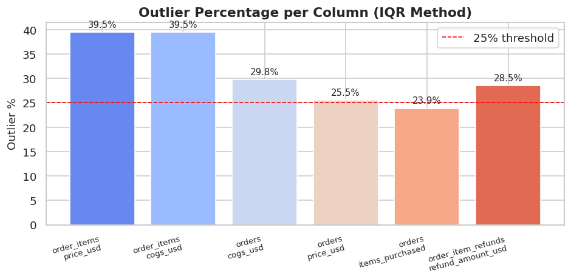{fig-alt="Bar chart showing outlier percentage per column" width=85%}

::: {.callout-warning}
## ⚠️ Interpretation Note — Not True Anomalies
The high outlier rates (~39%) in `price_usd` and `cogs_usd` for `order_items` are **expected, not problematic**. With only **4 fixed price points**, the IQR method naturally flags the minority price tier as statistical outliers. These are valid transactions — no cleansing is warranted.
:::

## Business Rules & Logic Validation {#sec-rules}

::: {.callout-tip}
## Section Details
- **Checks Performed:** 8
- **Scope:** Financial integrity, referential consistency, chronological logic
- **Result:** ✅ 8 / 8 Passed
:::

### Checks

| # | Check | Description | Result | Issues |
|:-:|:------|:------------|:------:|:------:|
| 1 | Negative Price | `price_usd < 0` in order_items | ✅ PASS | 0 |
| 2 | Refund Validation | `refund_amount_usd > price_usd` (over-refund) | ✅ PASS | 0 |
| 3 | Orphan Refunds | Refunds with no matching `order_item` | ✅ PASS | 0 |
| 4 | Loss Products | `cogs_usd > price_usd` (sold below cost) | ✅ PASS | 0 |
| 5 | Unmatched Dates | `orders.created_at ≠ order_items.created_at` | ✅ PASS | 0 |
| 6 | Refund Chronology | Refund date before purchase date | ✅ PASS | 0 |
| 7 | Duplicate Items | Same `order_item_id` appearing twice | ✅ PASS | 0 |
| 8 | Zero Price | Items sold at `$0.00` | ✅ PASS | 0 |

: Business Rules Validation — 8 Checks {#tbl-rules}

::: {.callout-note}
All 8 financial integrity and referential consistency checks returned **zero violations**. The dataset is fully trusted for all downstream revenue, margin, and cohort analysis.
:::

---

# Macro-Level Analysis {#sec-macro}

## Sales & Profitability Overview {#sec-kpis}

::: {.callout-tip}
## Section Details
- **Scope:** All-time aggregated metrics across orders, order_items, and refunds
- **Output Tables:** 1
:::

### Key Metrics

| Metric | Value |
|:-------|------:|
| Total Orders | 32,313 |
| Total Items Sold | 40,025 |
| Gross Revenue | $1,938,509.81 |
| Total COGS | $722,370.24 |
| Gross Profit | $1,216,139.56 |
| Total Refunds | $85,338.69 |
| Net Revenue | $1,853,171.11 |
| Profit Margin % | 62.74% |
| AOV (Avg Order Value) | $59.99 |
| Items Per Order | 1.24 |
| Refund Rate % | 4.40% |

: All-Time Business Metrics {#tbl-kpis}

### Chart — Revenue Breakdown

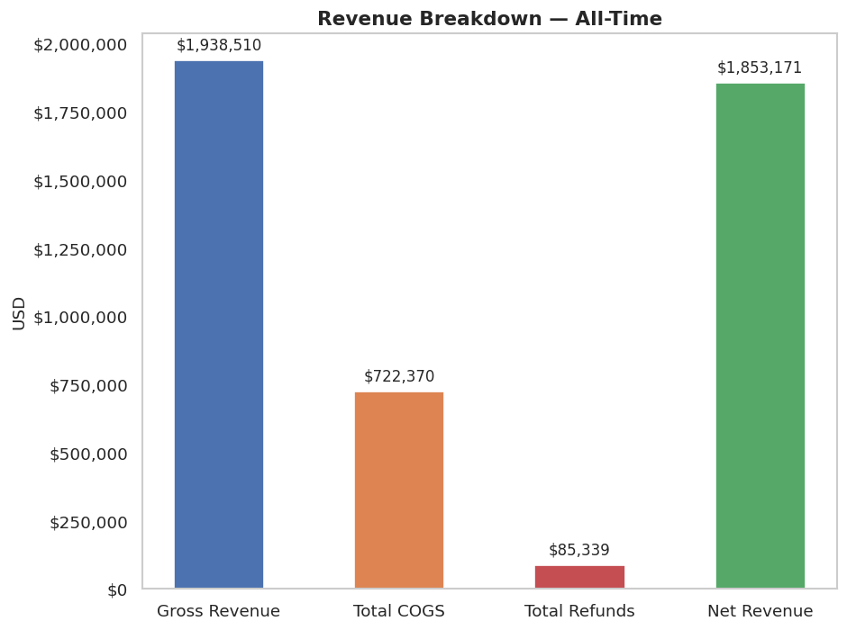{fig-alt="Bar chart showing revenue decomposition" width=80%}

### Key Observations

- **62.74% gross margin** on $1.94M revenue reflects a high-margin physical product business
- **Refund rate of 4.40%** ($85K) is well-controlled and within healthy e-commerce benchmarks
- **AOV of $59.99** is driven by the catalogue's fixed-price architecture and one dominant SKU
- **1.24 items per order** indicates limited cross-sell penetration — an opportunity for bundle strategies

## Yearly Performance Summary {#sec-yearly}

::: {.callout-tip}
## Section Details
- **Scope:** Annual aggregation with window-function YoY growth
- **Note:** 2015 is partial (Q1 only)
:::

### Results

| Year | Total Orders | Revenue | Gross Profit | YoY Growth |
|:----:|-------------:|--------:|-------------:|:----------:|
| 2012 | 2,586 | $129,274.14 | $78,873.00 | — |
| 2013 | 7,447 | $393,247.88 | $241,596.51 | +204.20% |
| 2014 | 16,860 | $1,075,612.22 | $679,722.53 | +173.52% |
| 2015 *(Q1 only)* | 5,420 | $340,375.56 | $215,947.51 | −68.36%* |

: Annual Performance Summary {#tbl-yearly}

*\* Misleading — partial year. See Q13 in Section 5 for the correct Q1-to-Q1 comparison.*

### Chart — Annual Revenue, Gross Profit & YoY Growth

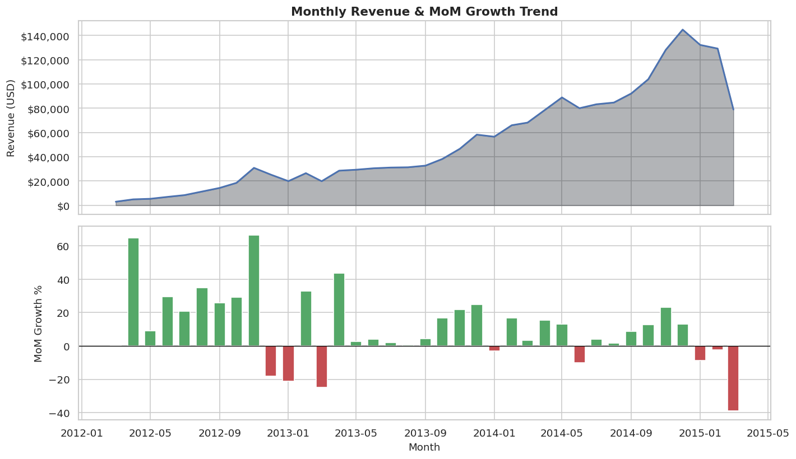{fig-alt="Grouped bar chart with revenue and profit, YoY growth on secondary axis" width=95%}

::: {.callout-warning}
## ⚠️ 2015 Partial Year Warning
The apparent **−68.36% revenue decline in 2015** is a data cut-off artefact (data ends March 2015). A Q1-to-Q1 comparison (Section 5, Q13) reveals continued growth.
:::

## Monthly Revenue & Growth Trends {#sec-monthly}

::: {.callout-tip}
## Section Details
- **Scope:** Monthly aggregation with MoM % growth
- **Period:** March 2012 – March 2015
- **Output Tables:** 1
:::

### Sample — First 10 Months

| Month | Orders | Revenue | Gross Profit | AOV | MoM Growth |
|:-----:|-------:|--------:|-------------:|----:|:----------:|
| 2012-03 | 60 | $2,999.40 | $1,830.00 | $49.99 | — |
| 2012-04 | 99 | $4,949.01 | $3,019.50 | $49.99 | +65.0% |
| 2012-05 | 108 | $5,398.92 | $3,294.00 | $49.99 | +9.1% |
| 2012-06 | 140 | $6,998.60 | $4,270.00 | $49.99 | +29.6% |
| 2012-07 | 169 | $8,448.31 | $5,154.50 | $49.99 | +20.7% |
| 2012-08 | 228 | $11,397.72 | $6,954.00 | $49.99 | +34.9% |
| 2012-09 | 287 | $14,347.13 | $8,753.50 | $49.99 | +25.9% |
| 2012-10 | 371 | $18,546.29 | $11,315.50 | $49.99 | +29.3% |
| 2012-11 | 618 | $30,893.82 | $18,849.00 | $49.99 | +66.6% |
| 2012-12 | 506 | $25,294.94 | $15,433.00 | $49.99 | −18.1% |

: Monthly Trends — First 10 Months (Sample) {#tbl-monthly}

### Chart — Monthly Revenue & MoM Growth (2012–2015)

{fig-alt="Area chart of monthly revenue with MoM growth bar chart below" width=95%}

### Key Observations

- Clear **Q4 seasonal spike every year** (November–December) consistent with holiday toy demand
- **January–February dips** (red bars) appear after each peak — predictable post-holiday correction
- **Consistent upward baseline** across all 3 years despite seasonal oscillation

## Top Products by Revenue & Margin {#sec-products}

::: {.callout-tip}
## Section Details
- **Scope:** All-time product performance with revenue, profit, and margin
- **SKUs:** 4 products
:::

### Results

| Product | Items Sold | Revenue | Gross Profit | Margin % |
|:--------|:----------:|--------:|-------------:|:--------:|
| The Original Mr. Fuzzy | 24,226 | $1,211,057.78 | $738,893.05 | 61.01% |
| The Forever Love Bear | 5,796 | $347,702.05 | $217,350.00 | 62.51% |
| The Birthday Sugar Panda | 4,985 | $229,260.16 | $157,027.51 | **68.49%** |
| The Hudson River Mini Bear | 5,018 | $150,489.82 | $102,869.00 | **68.36%** |

: Product Revenue & Margin — All SKUs {#tbl-products}

### Chart — Product Revenue & Gross Margin %

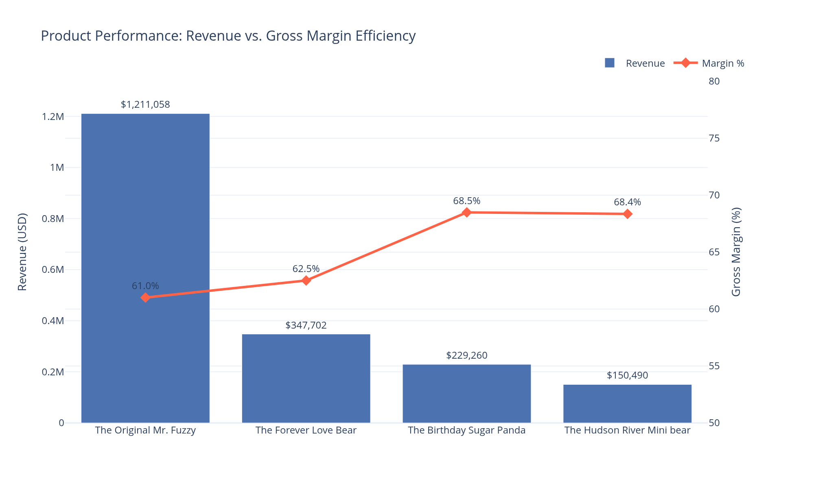{fig-alt="Dual-axis chart with revenue bars and margin percentage line" width=90%}

::: {.panel-tabset}

#### Revenue View
**The Original Mr. Fuzzy** dominates revenue with $1.21M (62.5% share) through sheer volume — 24,226 units vs 5,000–5,800 for all other SKUs.

#### Margin View
The two newer products — **The Birthday Sugar Panda** and **The Hudson River Mini Bear** — command a **7.5pp higher margin** (68%+) vs Mr. Fuzzy (61.01%). A product-mix shift toward these SKUs would structurally expand overall profitability without requiring revenue growth.

#### Opportunity
Increasing promotional weight on the high-margin SKUs, and designing cross-sell bundles anchored on Mr. Fuzzy volume, represents the highest-leverage product-level action available.

:::

## Traffic Source Efficiency {#sec-traffic}

::: {.callout-tip}
## Section Details
- **Scope:** All UTM source/campaign combinations from `website_sessions` joined to `orders`
- **Key Metric:** Conversion rate (CVR) = orders / sessions
:::

### Results

| Source | Campaign | Sessions | Orders | CVR |
|:-------|:---------|:--------:|:------:|:---:|
| gsearch | nonbrand | 282,706 | 18,822 | 6.66% |
| direct | direct | 83,328 | 6,118 | 7.34% |
| bsearch | nonbrand | 54,909 | 3,818 | 6.95% |
| gsearch | brand | 33,329 | 2,511 | 7.53% |
| bsearch | brand | 7,914 | 701 | 8.86% |
| socialbook | desktop_targeted | 5,590 | 288 | 5.15% |
| socialbook | pilot | 5,095 | 55 | **1.08%** |

: Traffic Source Conversion Efficiency {#tbl-traffic}

### Chart — Sessions vs Conversion Rate by Source

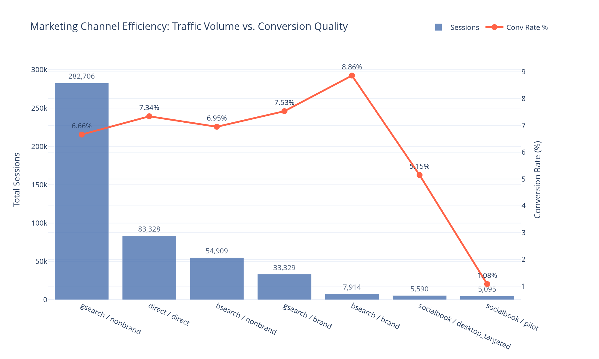{fig-alt="Dual-axis bar and line chart of sessions and conversion rates" width=95%}

### Key Observations

- **gsearch nonbrand** is the volume engine (282K sessions, 59.8% of paid traffic) but has the lowest paid CVR
- **bsearch brand (8.86% CVR)** is the most efficient channel — highest-intent visitors already searching by brand name
- **socialbook pilot (1.08% CVR)** is a clear underperformer — producing only 55 orders from 5,095 sessions

## Device Performance Gap {#sec-device}

::: {.callout-tip}
## Section Details
- **Scope:** `website_sessions` joined to `orders` by `website_session_id`, grouped by `device_type`
:::

### Results

| Device | Sessions | Orders | CVR |
|:-------|:--------:|:------:|:---:|
| Desktop | 327,027 | 27,805 | **8.50%** |
| Mobile | 145,844 | 4,508 | **3.09%** |

: Device Performance — Mobile vs Desktop {#tbl-device}

### Chart — Mobile vs Desktop: Sessions, Orders, CVR

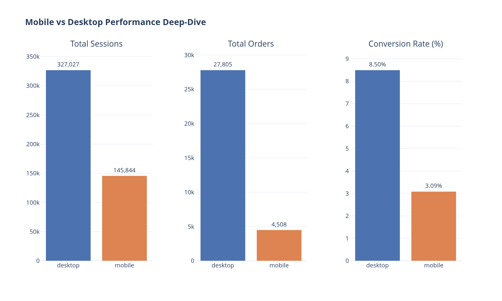{fig-alt="Three-panel comparison of mobile vs desktop metrics" width=90%}

::: {.callout-warning}
## ⚠️ Mobile CVR Gap — Primary Optimisation Opportunity
Mobile represents **31% of sessions** but only **14% of orders**. The 2.75× CVR gap (3.09% vs 8.50%) is the single largest revenue leakage point on the platform. Closing even half this gap — bringing mobile CVR to ~5.8% — would add an estimated **~3,900 additional orders** at current session volumes.
:::

---

# Micro-Level Analysis {#sec-micro}

## Group 1 — Revenue & Profitability Deep Dive {#sec-g1}

### Q1 — Peak Season Margin: Mr. Fuzzy vs Sugar Panda (Nov–Dec 2014) {#sec-q1}

> **In November and December 2014 (peak season), what is the difference in profit margin between 'The Original Mr. Fuzzy' and 'The Birthday Sugar Panda', and which product was more profitable after accounting for refunds?**

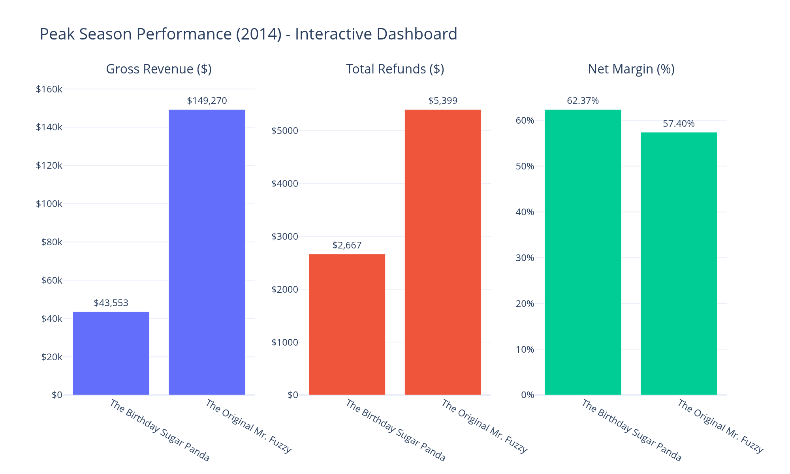{fig-alt="Bar chart comparing net profit and margin by product in peak season" width=85%}

- Examines whether Mr. Fuzzy's volume advantage survives when refunds are deducted during the highest-stakes window
- The Birthday Sugar Panda's structural margin advantage (68.49% vs 61.01%) is tested under peak-season refund pressure
- Result informs Q4 promotional budget allocation between the two SKUs

### Q2 — Refund Rate Anomaly: July–September 2013 {#sec-q2}

> **Between July and September 2013 (post 204% growth spike), which products had a disproportionately high refund rate relative to their sales volume?**

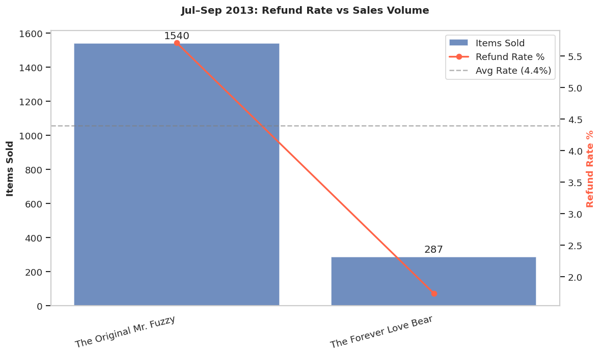{fig-alt="Dual-axis chart of volume and refund rates per product in summer 2013" width=90%}

- The 204% revenue spike in 2013 brought a surge in volume that may have strained fulfilment quality
- A high refund rate on a high-volume product in this window signals potential quality or logistics failure
- Result feeds directly into root-cause analysis for the refund rate benchmark (4.40%)

### Q3 — Top Gross Profit Months in 2014 vs AOV Benchmark {#sec-q3}

> **In 2014 (the highest revenue year at $1.07M), which three months generated the most gross profit, and did their AOV exceed the yearly average of $63.80?**

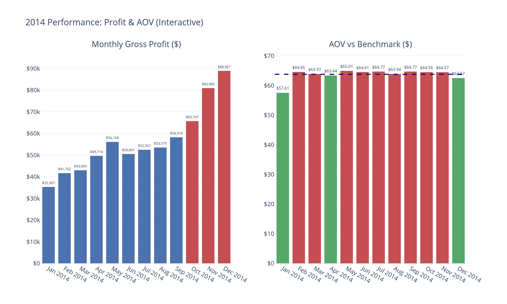{fig-alt="Bar and line chart of monthly gross profit with AOV reference line" width=90%}

- Identifies the three highest-value months and whether they were driven by volume or by premium purchasing behaviour (higher AOV)
- AOV above the $63.80 yearly average in peak months confirms customers purchase higher-value SKUs during holidays

---

## Group 2 — Product Performance {#sec-g2}

### Q4 — Weekly Sales: Hudson River Mini Bear vs Forever Love Bear (2014) {#sec-q4}

> **Despite ranking 4th in total revenue, were there specific weeks in 2014 where 'The Hudson River Mini Bear' outsold 'The Forever Love Bear'?**

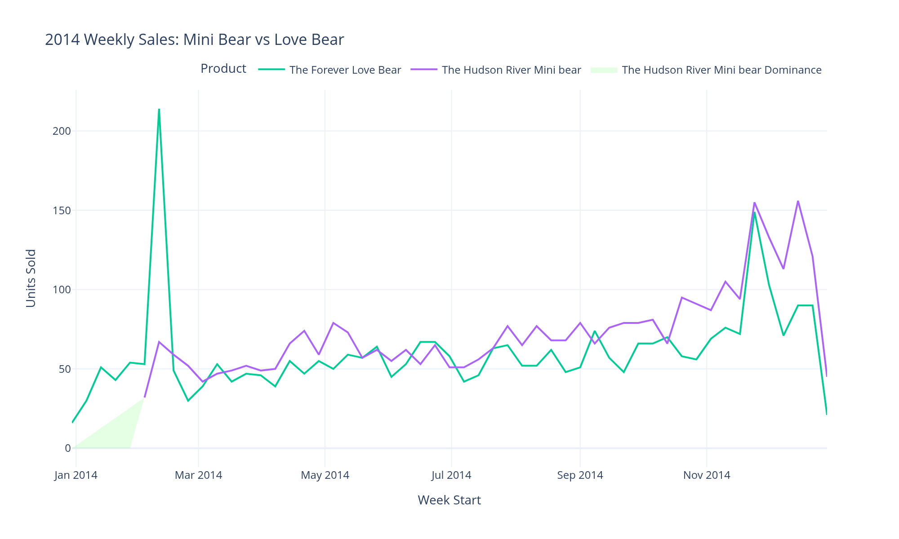{fig-alt="Weekly line chart comparing unit sales of two products across 2014" width=90%}

- Tests whether annual rankings mask short competitive windows driven by promotions or novelty
- Informs whether Mini Bear requires sustained support or naturally wins in specific calendar periods

### Q5 — Time to First 100 Orders: The Birthday Sugar Panda {#sec-q5}

> **After the launch of 'The Birthday Sugar Panda' in early 2014, how many days did it take to reach its first 100 orders?**

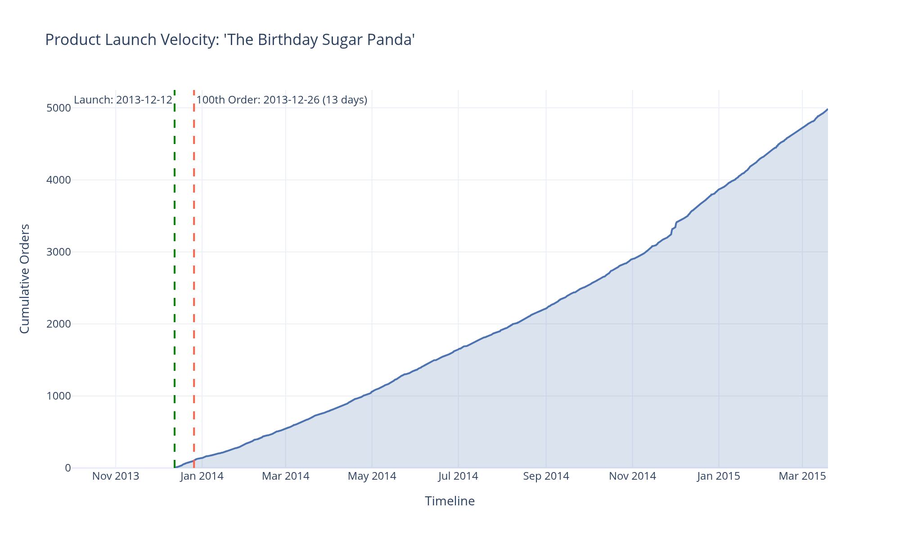{fig-alt="Cumulative order ramp chart with 100-order milestone marked" width=85%}

- Launch velocity benchmark for a new SKU entering an established catalogue
- Faster time-to-100 signals strong day-one demand and effective channel placement — a reference point for any future product launches

### Q6 — Cross-Sell Rate & Product Combinations (Q4 2014) {#sec-q6}

> **In Q4 2014 specifically, what was the cross-sell rate (orders with more than one item), and which product combinations were most common?**

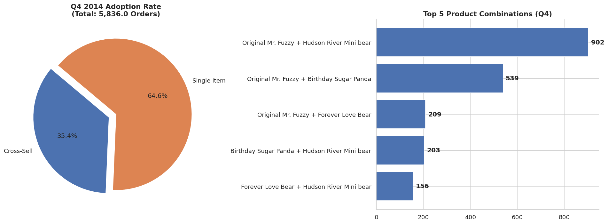{fig-alt="Cross-sell rate gauge and product combination frequency chart" width=95%}

- Q4 2014 is the highest-volume quarter — the most statistically robust window to observe natural bundling behaviour
- Dominant product pairs directly inform upsell recommendations and bundle promotion design

---

## Group 3 — Traffic & Conversion {#sec-g3}

### Q7 — gsearch Nonbrand CVR: Seasonal Shift (Oct–Nov 2014) {#sec-q7}

> **In October and November 2014, did gsearch nonbrand maintain its all-time conversion rate of 6.66%, or was there a seasonal improvement or decline?**

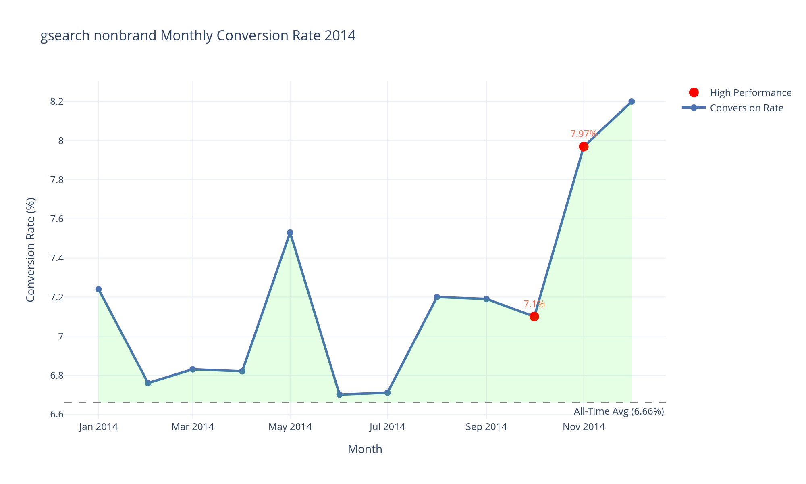{fig-alt="Line chart of gsearch nonbrand monthly CVR with 6.66% reference line" width=85%}

- Paid search CVR typically improves in Q4 due to higher purchase intent; a decline would flag creative or landing page issues
- Validates (or challenges) the assumption that seasonal bid increases are justified

### Q8 — Desktop vs Mobile CVR Gap: gsearch Nonbrand (Q1 2013) {#sec-q8}

> **In the first three months of 2013, what was the conversion rate gap between desktop and mobile for the gsearch nonbrand campaign specifically?**

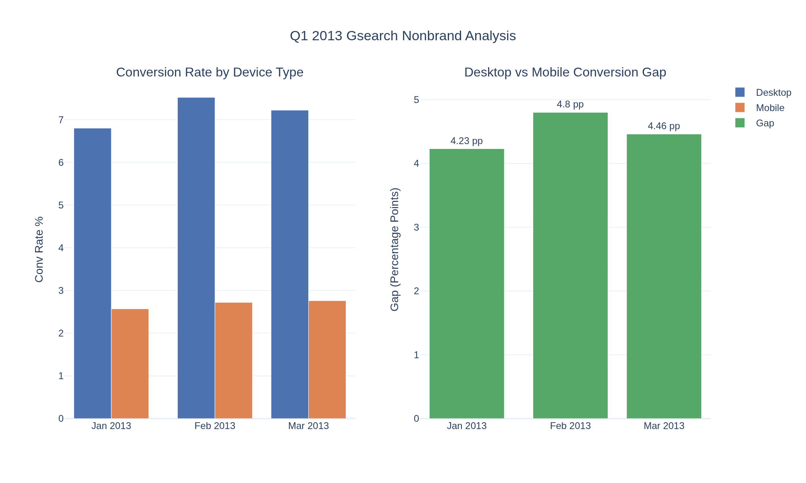{fig-alt="Grouped bar chart of monthly CVR split by device for gsearch nonbrand" width=85%}

- Isolating one channel removes audience composition effects and gives the cleanest device-level UX signal
- Establishes whether the mobile gap (3.09% vs 8.50% all-time) was already present in the platform's first year of growth

---

## Group 4 — Device & Session Behaviour {#sec-g4}

### Q9 — Was the Mobile Gap Always This Wide? (2012 Baseline) {#sec-q9}

> **In 2012, was the mobile vs desktop conversion rate gap already as wide as the all-time gap (3.09% vs 8.50%), or were the two devices closer in performance at the start?**

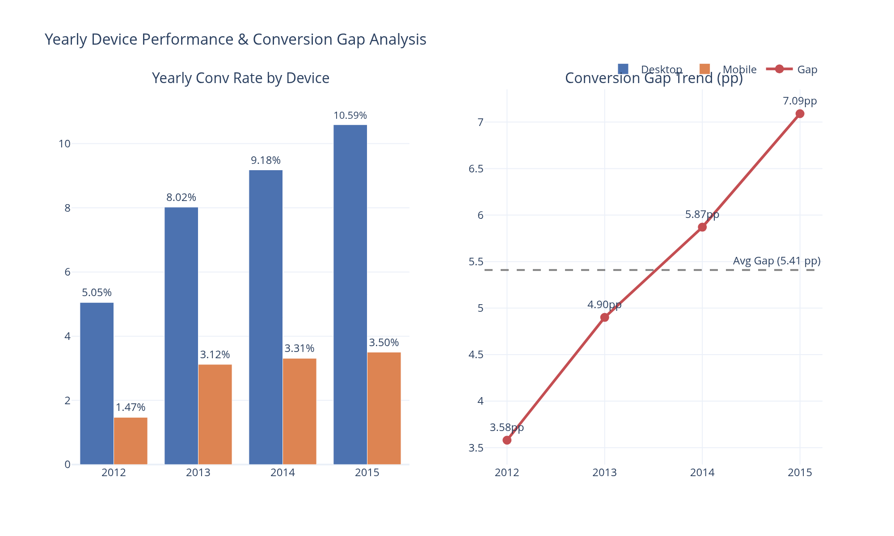{fig-alt="Year-by-year grouped bar chart of mobile and desktop conversion rates" width=85%}

::: {.panel-tabset}

#### Gap Widened Over Time
If the gap grew from 2012 to 2014, it suggests mobile experience degraded relative to desktop as the site scaled — pointing to technical debt or layout decisions that harmed mobile UX over time.

#### Gap Was Always Wide
If the gap existed at the same magnitude from day one, the problem is structural — a mobile-first redesign is the only meaningful fix, not incremental patches.

:::

### Q10 — Best Conversion Day of the Week: Desktop (2014) {#sec-q10}

> **In 2014, which day of the week had the highest desktop session volume, and did it also correspond to the highest desktop conversion rate?**

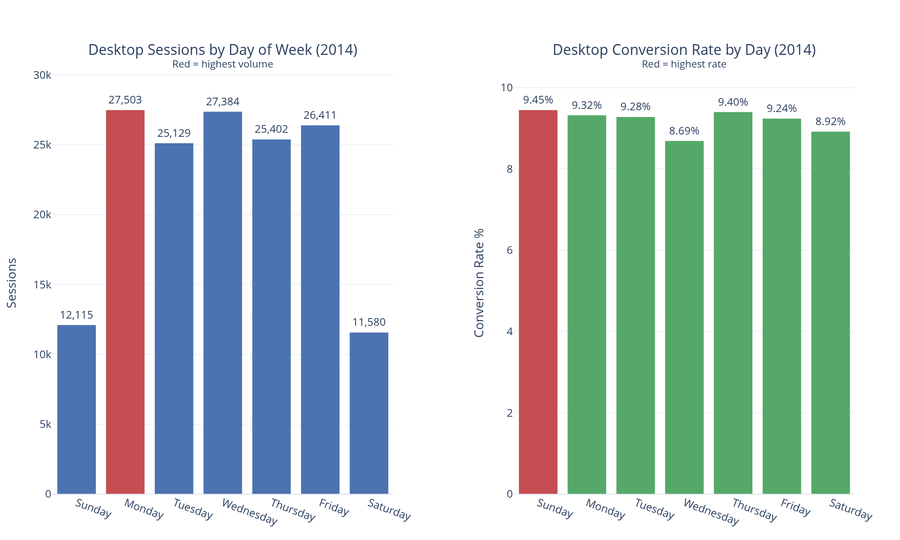{fig-alt="Bar and line chart of desktop sessions and CVR split by weekday" width=85%}

- High-volume days don't always convert at the highest rate — budget and bidding should align to CVR patterns, not just volume
- The gap between peak-volume day and peak-CVR day is a direct paid search optimisation signal

---

## Group 5 — Refunds & Risk {#sec-g5}

### Q11 — Monthly Refund Rate: 2014 Spike Detection {#sec-q11}

> **What was the monthly refund distribution across 2014, and were there any months with a refund rate spike above the all-time average of 4.4%?**

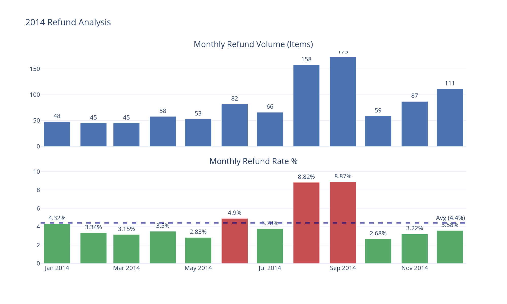{fig-alt="Monthly refund rate line chart with 4.4% reference threshold" width=90%}

- **Months above 4.4%** represent quality or fulfilment events requiring investigation
- Q4 spikes may reflect holiday rush logistics failures; non-peak spikes may point to specific product batches or campaign audiences

### Q12 — Per-Product Refund Rate: Mr. Fuzzy vs Sugar Panda {#sec-q12}

> **What is the individual refund rate for 'The Original Mr. Fuzzy' (highest volume, 24,226 items) vs 'The Birthday Sugar Panda' (highest margin, 68.49%)?**

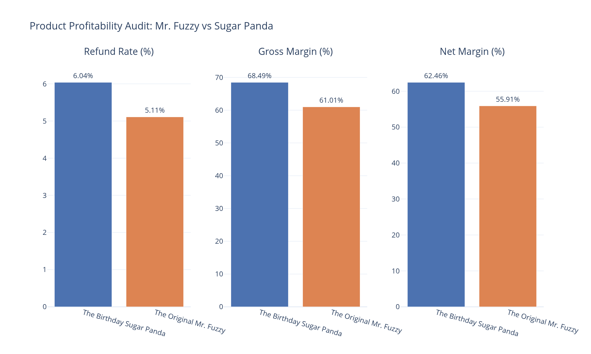{fig-alt="Dual chart of refund rates and net profitability per product" width=85%}

- A higher refund rate on Sugar Panda would erode its net margin advantage vs Mr. Fuzzy
- A lower refund rate on Mr. Fuzzy — despite lower gross margin — could make it the true **net profit leader** after refunds

---

## Group 6 — Growth & Anomalies {#sec-g6}

### Q13 — True YoY Growth: Q1 2015 vs Q1 2014 {#sec-q13}

> **The 2015 data ends in March, causing a misleading −68.36% YoY figure. What is the true Q1-to-Q1 growth rate when comparing Q1 2015 vs Q1 2014?**

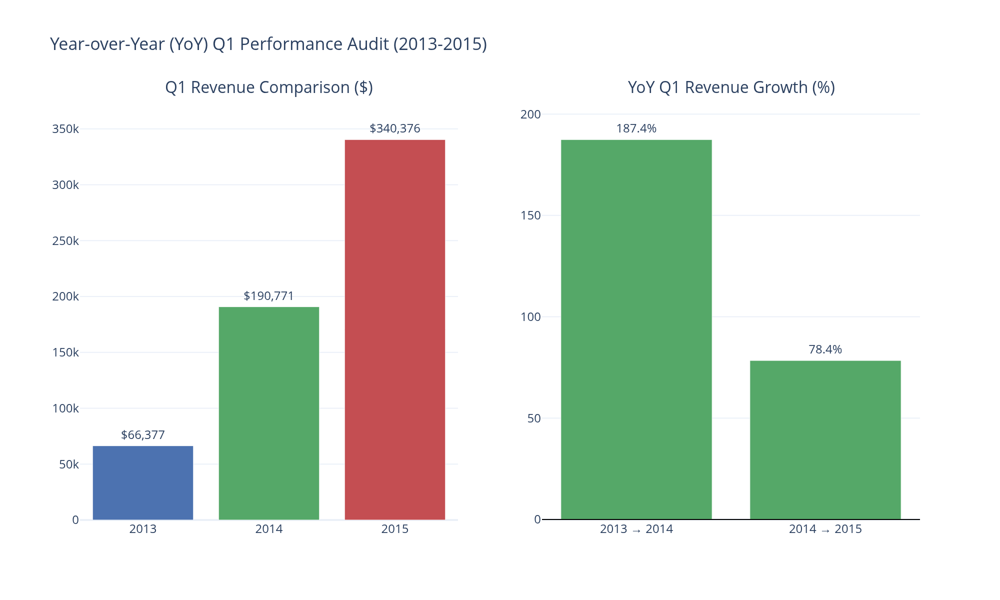{fig-alt="Bar chart comparing Q1 revenue across 2012 to 2015" width=80%}

::: {.callout-note}
The correct methodology for communicating 2015 performance is a **Q1-to-Q1 comparison** — not a full-year comparison. This is the number to present to stakeholders when the fiscal year is not yet complete.
:::

### Q14 — Top 5 Highest Revenue Days Across All 3 Years {#sec-q14}

> **What were the top 5 highest revenue days across all three years, and are they clustered in the same seasonal periods or spread across different windows?**

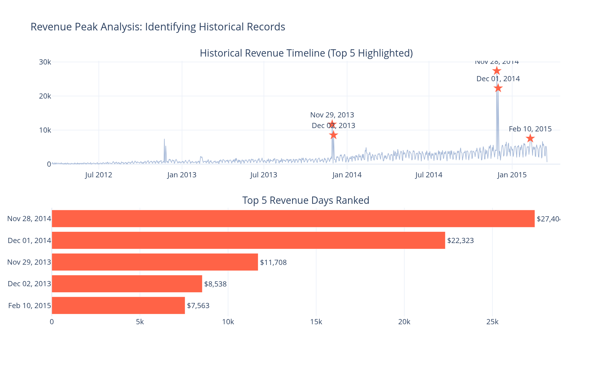{fig-alt="Bar chart of the top 5 highest single-day revenue figures with dates" width=85%}

- Clustering in a narrow Q4 window confirms seasonal revenue concentration risk
- Spread across multiple periods would signal a more resilient demand pattern and lower dependence on holiday performance

---

# Summary & Recommendations {.unnumbered}

## Data Quality

::: {.callout-note}
## ✅ Perfect Data Quality Score
Zero nulls · Zero duplicates · 8/8 business rules passed · Consistent temporal coverage across all tables
:::

## Business Performance

| Dimension | Finding |
|:----------|:--------|
| Revenue | $1.94M gross over 3 years — 8.3× growth from 2012 to 2014 |
| Profitability | 62.74% gross margin — structurally high-margin product model |
| Refunds | 4.40% refund rate — well-controlled across all SKUs |
| AOV | $59.99 — driven by fixed-price catalogue architecture |

: Performance Summary {#tbl-perf-summary}

## Recommended Actions

| Priority | Area | Action |
|:--------:|:-----|:-------|
| 🔴 High | Mobile UX | Audit checkout on mobile — closing CVR gap from 3.09% to 5.8% adds ~3,900 orders |
| 🔴 High | Channel Mix | Reallocate socialbook pilot budget (1.08% CVR) to bsearch brand (8.86% CVR) |
| 🟡 Medium | Product Mix | Increase promotional weight on Sugar Panda & Mini Bear — 68%+ margin vs 61% for Mr. Fuzzy |
| 🟡 Medium | Seasonality | Pre-position inventory and increase bids in October for Q4 peak capture |
| 🟢 Low | Reporting | Use Q1-to-Q1 comparisons for 2015 stakeholder communications |

: Strategic Recommendations {#tbl-recs}

---

# Notes & Tips {.unnumbered}

::: {.callout-warning}
## Important Considerations
- **2015 partial data:** All year-level comparisons involving 2015 must use Q1-to-Q1 logic — full-year figures are not comparable
- **4 SKUs only:** The narrow catalogue means product-level analysis has high statistical power but limited diversification
- **Fixed pricing:** `price_usd` has only 4 unique values — IQR outlier flags on price columns are expected artefacts, not data errors
- **Device gap:** The mobile CVR figure (3.09%) is an all-time aggregate — segment by campaign and year for more actionable device analysis
:::

## Analysis Workflow

| Stage | Sections | Purpose |
|:------|:---------|:--------|
| **Data Validation** | 2, 3 | Confirm data is trustworthy before any analysis |
| **Baseline Metrics** | 4.1, 4.2 | Establish revenue and profit reference points |
| **Channel & Product** | 4.4, 4.5, 4.6 | Identify top growth and optimisation levers |
| **Deep Dives** | 5.1–5.6 | Answer specific business questions with targeted queries |

: Recommended Analysis Workflow {#tbl-workflow}

---

# Appendix {.unnumbered}

## Quick Section Links

::: {.grid}

::: {.g-col-6}
- [Environment & Setup](#sec-setup)
- [EDA & Data Quality](#sec-eda)
- [Outlier Analysis](#sec-outliers)
- [Business Rules](#sec-rules)
- [KPI Overview](#sec-kpis)
- [Yearly Performance](#sec-yearly)
- [Monthly Trends](#sec-monthly)
:::

::: {.g-col-6}
- [Top Products](#sec-products)
- [Traffic Sources](#sec-traffic)
- [Device Performance](#sec-device)
- [Revenue Deep Dive](#sec-g1)
- [Product Performance](#sec-g2)
- [Traffic & Conversion](#sec-g3)
- [Refunds & Risk](#sec-g5)
:::

:::

